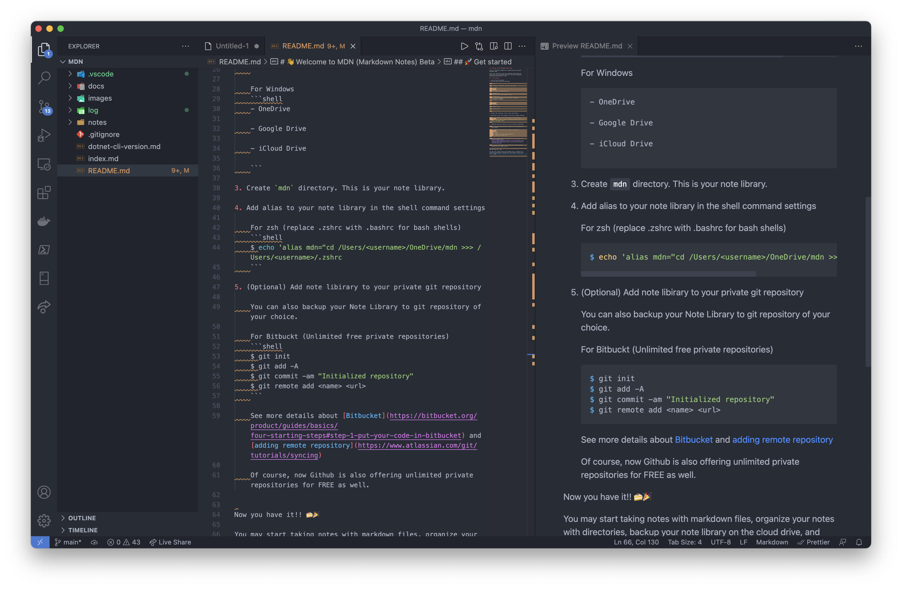
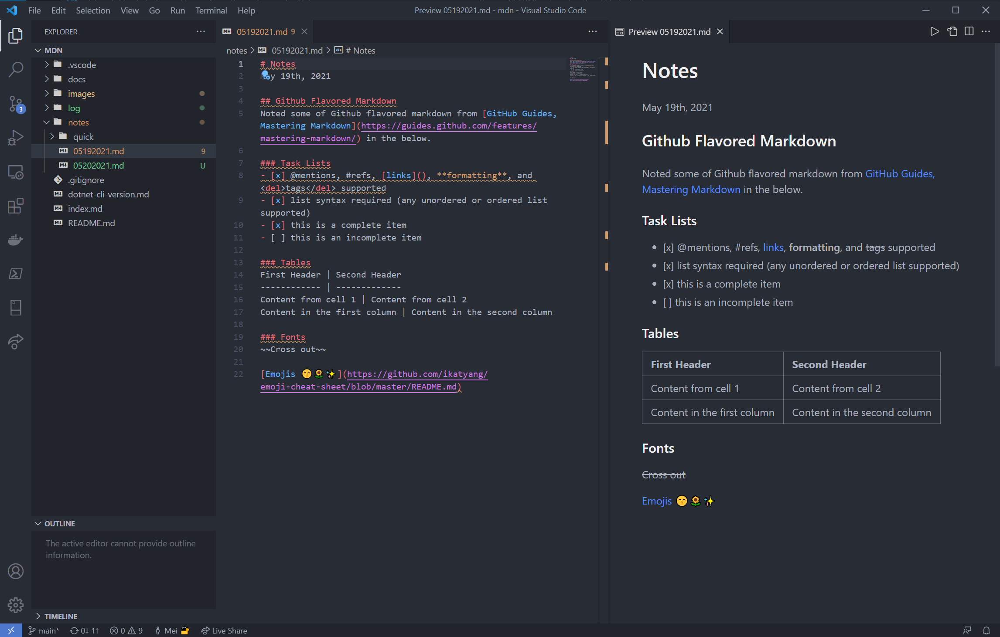

# 👋 Welcome to MDN (Markdown Notes) Beta

This is a directory template for organizing your flavored markdown notes.

Store `mdn` direcotry into your preffered cloud drive and access from any envirnoment with your favoriate Integrated Development Envinorment or IDE!




---

## 🚀 Get started

1. Log in to your terminal
2. cd into your cloud drive directory

	*i.e.*

	\* replace `<username>` with your user name

	For macOS
	```shell
	- OneDrive
	$ cd /Users/<username>/OneDrive

	- Google Drive
	$ cd /Users/<username>/Google\ Drive

	- iCloud Drive
	$ cd /Users/<username>/Library/Mobile\ Documents/com\~apple\~CloudDocs
	```

	For Windows
	```shell
	- OneDrive
	C:\Users\<username>\OneDrive
	- Google Drive
	G:\'My Drive'
	- iCloud Drive
	C:\Users\<username>\iCloudDrive
	```

3. Create `mdn` directory. This is your note library.

4. Add alias to your note library in the shell command settings

	For zsh (replace .zshrc with .bashrc for bash shells)
	```shell
	$ echo 'alias mdn="cd /Users/<username>/OneDrive/mdn >> /Users/<username>/.zshrc
	```

5. (Optional) Add note library to your private git repository

	You can also backup your Note Library to git repository of your choice.

	For Bitbuckt (Unlimited free private repositories)
	```shell
	$ git init
	$ git add -A
	$ git commit -am "Initialized repository"
	$ git remote add <name> <url>
	```

	See more details about [Bitbucket](https://bitbucket.org/product/guides/basics/four-starting-steps#step-1-put-your-code-in-bitbucket) and [adding remote repository](https://www.atlassian.com/git/tutorials/syncing)

	Of course, now Github is also offering unlimited private repositories for FREE as well.


Now you have it!! 🍰🎉

You may start taking notes with markdown files, organize your notes with directories, backup your markdown note library on the cloud drive, and access to it from any where.

### Template available
[https://github.com/meiokubo/mdn](https://github.com/meiokubo/mdn)
